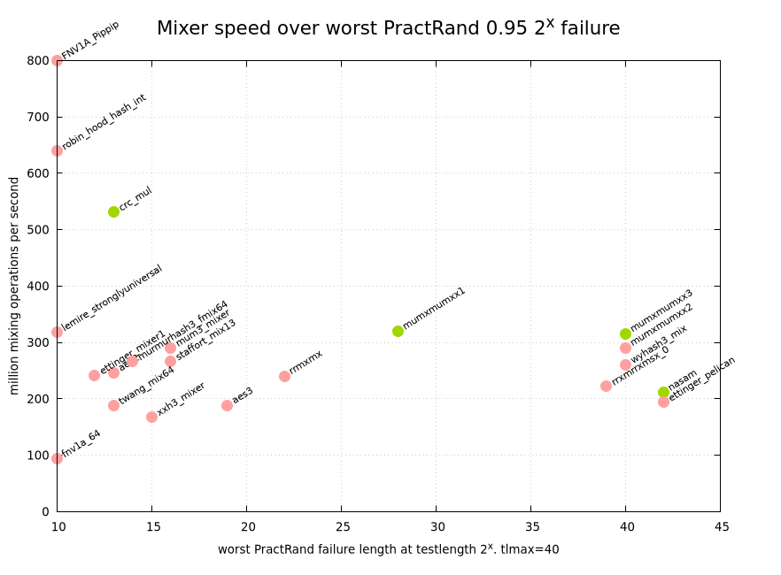

<a id="top"></a>

# Better Faster Stronger Mixer

<!--ts-->
   * [Mixing Speed](#mixing-speed)
   * [Mixing Quality](#mixing-quality)
   * [Results](#results)
   * Mixers:
     [FNV1A_Pippip](#fnv1a_pippip),
     [aes2](#aes2),
     [aes3](#aes3),
     [crc_mul](#crc_mul),
     [ettinger_mixer1](#ettinger_mixer1),
     [ettinger_mixer2](#ettinger_mixer2),
     [fnv1a_64](#fnv1a_64),
     [lemire_stronglyuniversal](#lemire_stronglyuniversal),
     [mum3_mixer](#mum3_mixer),
     [mumxmumxx1](#mumxmumxx1),
     [mumxmumxx2](#mumxmumxx2),
     [mumxmumxx3](#mumxmumxx3),
     [murmurhash3_fmix64](#murmurhash3_fmix64),
     [robin_hood_hash_int](#robin_hood_hash_int),
     [rrmxmx](#rrmxmx),
     [rrxmrrxmsx_0](#rrxmrrxmsx_0),
     [staffort_mix13](#staffort_mix13),
     [twang_mix64](#twang_mix64),
     [wyhash3_mix](#wyhash3_mix),
     [xxh3_mixer](#xxh3_mixer)
<!--te-->

Testing framework for the quest to find a fast &amp; strong mixer, e. g. for hashtables.
Many modern hashtables like [robin_hood::unordered_map](https://github.com/martinus/robin-hood-hashing) or
[Abseil's hash tables](https://abseil.io/docs/cpp/guides/container#hash-tables) require high quality hashing for their tables to work efficiently.

# Mixing Speed

Generated with [nanobench](https://github.com/martinus/nanobench), g++ 9.2, `-O3 -march=native`, on an Intel i7-8700 CPU locked to 3.20GHz

|               ns/op |                op/s |    err% |          ins/op |          cyc/op |    IPC |         bra/op |   miss% |     total | benchmark
|--------------------:|--------------------:|--------:|----------------:|----------------:|-------:|---------------:|--------:|----------:|:----------
|                1.25 |      799,436,335.34 |    0.0% |            3.00 |            4.00 |  0.751 |           0.00 |    0.0% |      0.00 | `FNV1A_Pippip`
|                4.07 |      245,934,865.72 |    0.0% |            4.00 |           12.99 |  0.308 |           0.00 |    0.0% |      0.00 | `aes2`
|                5.32 |      188,075,153.37 |    0.0% |            5.00 |           16.98 |  0.295 |           0.00 |    0.0% |      0.00 | `aes3`
|                1.88 |      532,956,443.53 |    0.0% |            5.00 |            5.99 |  0.835 |           0.00 |    0.0% |      0.00 | `crc_mul`
|                4.14 |      241,447,855.03 |    0.0% |           15.00 |           13.23 |  1.134 |           0.00 |    0.0% |      0.00 | `ettinger_mixer1`
|                5.17 |      193,519,486.34 |    0.0% |           21.00 |           16.50 |  1.273 |           0.00 |    0.0% |      0.00 | `ettinger_mixer2`
|               10.63 |       94,049,146.35 |    0.0% |           38.01 |           33.95 |  1.119 |           0.00 |    0.0% |      0.00 | `fnv1a_64`
|                3.15 |      317,831,100.56 |    0.3% |           18.00 |           10.06 |  1.790 |           0.00 |    0.0% |      0.00 | `lemire_stronglyuniversal`
|                3.44 |      290,636,264.57 |    0.0% |            9.00 |           10.99 |  0.819 |           0.00 |    0.0% |      0.00 | `mum3_mixer`
|                3.13 |      319,642,931.98 |    0.0% |            9.00 |            9.99 |  0.901 |           0.00 |    0.0% |      0.00 | `mumxmumxx1`
|                3.44 |      290,583,035.87 |    0.0% |           11.00 |           10.99 |  1.001 |           0.00 |    0.0% |      0.00 | `mumxmumxx2`
|                3.13 |      319,760,942.47 |    0.0% |            8.00 |            9.99 |  0.801 |           0.00 |    0.0% |      0.00 | `mumxmumxx3`
|                3.76 |      266,269,957.68 |    0.0% |           13.00 |           11.99 |  1.084 |           0.00 |    0.0% |      0.00 | `murmurhash3_fmix64`
|                1.56 |      639,449,772.84 |    0.0% |            4.00 |            5.00 |  0.801 |           0.00 |    0.0% |      0.00 | `robin_hood_hash_int`
|                4.16 |      240,133,099.18 |    0.1% |           13.00 |           13.30 |  0.977 |           0.00 |    0.0% |      0.00 | `rrmxmx`
|                4.51 |      221,797,240.96 |    0.1% |           15.00 |           14.39 |  1.042 |           0.00 |    0.0% |      0.00 | `rrxmrrxmsx_0`
|                3.76 |      266,285,145.56 |    0.0% |           13.00 |           12.00 |  1.084 |           0.00 |    0.0% |      0.00 | `staffort_mix13`
|                5.32 |      187,920,592.19 |    0.0% |           19.00 |           17.00 |  1.118 |           0.00 |    0.0% |      0.00 | `twang_mix64`
|                3.83 |      260,771,165.13 |    0.0% |           14.00 |           12.25 |  1.143 |           0.00 |    0.0% |      0.00 | `wyhash3_mix`
|                5.95 |      167,926,373.82 |    0.0% |           21.00 |           19.02 |  1.104 |           0.00 |    0.0% |      0.00 | `xxh3_mixer`

# Mixing Quality

The testing protocol is taken from by Pelle Evensen's blog post [Better, stronger mixer and a test procedure](http://mostlymangling.blogspot.com/2019/01/better-stronger-mixer-and-test-procedure.html):

Successive increasing numbers, which are rotated right, then optionally bitorder is reversed, are fed into a mixer. The mixer's output is fed into PractRand, which analyzes the quality of the generated number. So basically, the algorithm is this:

```cpp
// e.g. for rotation 37, and enabled bitreverse:
int rotation = 37;
uint64_t ctr = 0;
while (true) {
    feedPractRand(mixer(bitreverse64(rotr(ctr, rotation))));
    ++ctr;
}
```

In my tests, I run PractRand 0.95 with the arguments `RNG_test stdin64 -tf 2 -tlmin 10 -tlmax 40`. The test aborts when it detects a failure in the quality of the mixer results.

Ideally, a mixer doesn't fail the practrand test and is as fast as possible. In the following plot I show the results of the mixers that I have already evaluated. Pareto optimums are green (I consider 2^10 still a failure).

# Results



An ideal mixer should be in the upper right corner. The pareto front is colored green (except anything that already
fails on tlmax=10. I consider these mixers as too bad for practical use).


## FNV1A_Pippip

### identity, rotation 0 - 63

|      |  0 |  1 |  2 |  3 |  4 |  5 |  6 |  7 |  8 |  9 | 10 | 11 | 12 | 13 | 14 | 15
|-----:|---:|---:|---:|---:|---:|---:|---:|---:|---:|---:|---:|---:|---:|---:|---:|---:
| **0**| 10 | 10 | 10 | 10 | 10 | 10 | 10 | 10 | 10 | 10 | 10 | 10 | 10 | 10 | 10 | 10 
|**16**| 10 | 10 | 10 | 10 | 10 | 10 | 10 | 10 | 10 | 10 | 10 | 10 | 10 | 10 | 10 | 10 
|**32**| 10 | 10 | 10 | 10 | 10 | 10 | 10 | 10 | 10 | 10 | 10 | 10 | 10 | 10 | 10 | 10 
|**48**| 10 | 10 | 10 | 10 | 10 | 10 | 10 | 10 | 10 | 10 | 10 | 10 | 10 | 10 | 10 | 10 

min: 2^10, max: 2^10, mean: 2^10.0

### identity, rotation 0 - 63

|      |  0 |  1 |  2 |  3 |  4 |  5 |  6 |  7 |  8 |  9 | 10 | 11 | 12 | 13 | 14 | 15
|-----:|---:|---:|---:|---:|---:|---:|---:|---:|---:|---:|---:|---:|---:|---:|---:|---:
| **0**| 10 | 10 | 10 | 10 | 10 | 10 | 10 | 10 | 10 | 10 | 10 | 10 | 10 | 10 | 10 | 10 
|**16**| 10 | 10 | 10 | 10 | 10 | 10 | 10 | 10 | 10 | 10 | 10 | 10 | 10 | 10 | 10 | 10 
|**32**| 10 | 10 | 10 | 10 | 10 | 10 | 10 | 10 | 10 | 10 | 10 | 10 | 10 | 10 | 10 | 10 
|**48**| 10 | 10 | 10 | 10 | 10 | 10 | 10 | 10 | 10 | 10 | 10 | 10 | 10 | 10 | 10 | 10

## aes2

### identity, rotation 0 - 63

|      |  0 |  1 |  2 |  3 |  4 |  5 |  6 |  7 |  8 |  9 | 10 | 11 | 12 | 13 | 14 | 15
|-----:|---:|---:|---:|---:|---:|---:|---:|---:|---:|---:|---:|---:|---:|---:|---:|---:
| **0**| 15 | 15 | 16 | 16 | 16 | 16 | 16 | 16 | 16 | 13 | 13 | 14 | 14 | 14 | 14 | 15 
|**16**| 15 | 15 | 15 | 14 | 14 | 14 | 15 | 15 | 15 | 14 | 14 | 14 | 14 | 14 | 15 | 15 
|**32**| 15 | 16 | 16 | 16 | 16 | 16 | 16 | 16 | 16 | 14 | 14 | 14 | 14 | 14 | 14 | 15 
|**48**| 15 | 14 | 14 | 14 | 14 | 14 | 15 | 15 | 15 | 14 | 14 | 14 | 14 | 14 | 15 | 15 

min: 2^13, max: 2^16, mean: 2^14.7

### identity, rotation 0 - 63

|      |  0 |  1 |  2 |  3 |  4 |  5 |  6 |  7 |  8 |  9 | 10 | 11 | 12 | 13 | 14 | 15
|-----:|---:|---:|---:|---:|---:|---:|---:|---:|---:|---:|---:|---:|---:|---:|---:|---:
| **0**| 15 | 16 | 16 | 16 | 16 | 16 | 16 | 16 | 16 | 14 | 14 | 13 | 14 | 15 | 15 | 15 
|**16**| 15 | 14 | 14 | 14 | 14 | 14 | 15 | 15 | 15 | 15 | 13 | 14 | 14 | 14 | 14 | 15 
|**32**| 15 | 16 | 16 | 16 | 16 | 16 | 16 | 16 | 16 | 14 | 14 | 13 | 14 | 14 | 15 | 15 
|**48**| 15 | 14 | 14 | 14 | 14 | 14 | 15 | 15 | 15 | 14 | 13 | 14 | 14 | 14 | 15 | 15 

min: 2^13, max: 2^16, mean: 2^14.7

## aes3

TODO only tested up to `-tlmax 20`

### identity, rotation 0 - 63

|      |  0 |  1 |  2 |  3 |  4 |  5 |  6 |  7 |  8 |  9 | 10 | 11 | 12 | 13 | 14 | 15
|-----:|---:|---:|---:|---:|---:|---:|---:|---:|---:|---:|---:|---:|---:|---:|---:|---:
| **0**|>20 |>20 |>20 |>20 |>20 |>20 |>20 |>20 |>20 |>20 | 19 |>20 |>20 |>20 |>20 |>20 
|**16**|>20 |>20 |>20 |>20 |>20 |>20 |>20 |>20 |>20 |>20 |>20 |>20 |>20 |>20 |>20 |>20 
|**32**|>20 |>20 |>20 |>20 |>20 |>20 |>20 |>20 |>20 |>20 | 19 |>20 |>20 |>20 |>20 |>20 
|**48**|>20 |>20 |>20 |>20 |>20 |>20 |>20 |>20 |>20 |>20 |>20 |>20 |>20 |>20 |>20 |>20 

min: 2^19, max: 2^20, mean: 2^20.0

### identity, rotation 0 - 63

|      |  0 |  1 |  2 |  3 |  4 |  5 |  6 |  7 |  8 |  9 | 10 | 11 | 12 | 13 | 14 | 15
|-----:|---:|---:|---:|---:|---:|---:|---:|---:|---:|---:|---:|---:|---:|---:|---:|---:
| **0**|>20 |>20 |>20 |>20 |>20 |>20 |>20 |>20 |>20 |>20 | 19 |>20 |>20 |>20 |>20 |>20 
|**16**|>20 |>20 |>20 |>20 |>20 |>20 |>20 |>20 |>20 |>20 |>20 |>20 |>20 |>20 |>20 |>20 
|**32**|>20 |>20 |>20 |>20 |>20 |>20 |>20 |>20 |>20 |>20 | 19 |>20 |>20 |>20 |>20 |>20 
|**48**|>20 |>20 |>20 |>20 |>20 |>20 |>20 |>20 |>20 |>20 |>20 |>20 |>20 |>20 |>20 |>20 

min: 2^19, max: 2^20, mean: 2^20.0

## crc_mul

### identity, rotation 0 - 63

|      |  0 |  1 |  2 |  3 |  4 |  5 |  6 |  7 |  8 |  9 | 10 | 11 | 12 | 13 | 14 | 15
|-----:|---:|---:|---:|---:|---:|---:|---:|---:|---:|---:|---:|---:|---:|---:|---:|---:
| **0**| 13 | 13 | 14 | 13 | 13 | 13 | 13 | 13 | 13 | 13 | 13 | 13 | 13 | 13 | 13 | 13 
|**16**| 13 | 13 | 14 | 13 | 14 | 13 | 13 | 13 | 13 | 13 | 13 | 13 | 13 | 13 | 13 | 13 
|**32**| 13 | 13 | 13 | 13 | 13 | 14 | 13 | 14 | 14 | 13 | 13 | 13 | 13 | 13 | 13 | 13 
|**48**| 13 | 13 | 13 | 13 | 13 | 13 | 14 | 13 | 13 | 13 | 13 | 13 | 13 | 13 | 13 | 13 

min: 2^13, max: 2^14, mean: 2^13.1

### identity, rotation 0 - 63

|      |  0 |  1 |  2 |  3 |  4 |  5 |  6 |  7 |  8 |  9 | 10 | 11 | 12 | 13 | 14 | 15
|-----:|---:|---:|---:|---:|---:|---:|---:|---:|---:|---:|---:|---:|---:|---:|---:|---:
| **0**| 13 | 13 | 13 | 13 | 13 | 13 | 14 | 13 | 13 | 13 | 13 | 13 | 13 | 13 | 13 | 13 
|**16**| 13 | 13 | 13 | 13 | 13 | 13 | 13 | 13 | 13 | 13 | 14 | 13 | 13 | 13 | 13 | 13 
|**32**| 13 | 14 | 13 | 13 | 13 | 13 | 13 | 13 | 13 | 13 | 13 | 14 | 14 | 14 | 14 | 14 
|**48**| 13 | 13 | 13 | 13 | 13 | 13 | 13 | 13 | 13 | 13 | 13 | 13 | 13 | 13 | 13 | 13 

min: 2^13, max: 2^14, mean: 2^13.1

## ettinger_mixer1

TODO

## ettinger_mixer2

TODO

## fnv1a_64

### identity, rotation 0 - 63

|      |  0 |  1 |  2 |  3 |  4 |  5 |  6 |  7 |  8 |  9 | 10 | 11 | 12 | 13 | 14 | 15
|-----:|---:|---:|---:|---:|---:|---:|---:|---:|---:|---:|---:|---:|---:|---:|---:|---:
| **0**| 12 | 12 | 12 | 12 | 10 | 10 | 10 | 10 | 10 | 10 | 10 | 10 | 10 | 10 | 10 | 10 
|**16**| 10 | 10 | 10 | 10 | 10 | 11 | 10 | 10 | 10 | 10 | 10 | 10 | 11 | 13 | 13 | 10 
|**32**| 13 | 13 | 13 | 13 | 13 | 13 | 13 | 13 | 13 | 12 | 13 | 13 | 12 | 13 | 12 | 13 
|**48**| 13 | 12 | 13 | 12 | 12 | 12 | 12 | 12 | 12 | 12 | 13 | 12 | 13 | 13 | 13 | 13 

min: 2^10, max: 2^13, mean: 2^11.6

### identity, rotation 0 - 63

|      |  0 |  1 |  2 |  3 |  4 |  5 |  6 |  7 |  8 |  9 | 10 | 11 | 12 | 13 | 14 | 15
|-----:|---:|---:|---:|---:|---:|---:|---:|---:|---:|---:|---:|---:|---:|---:|---:|---:
| **0**| 10 | 10 | 10 | 10 | 11 | 12 | 12 | 12 | 12 | 12 | 13 | 13 | 14 | 13 | 13 | 13 
|**16**| 12 | 12 | 12 | 12 | 12 | 12 | 12 | 13 | 13 | 13 | 14 | 12 | 13 | 13 | 13 | 13 
|**32**| 13 | 13 | 13 | 12 | 13 | 13 | 13 | 13 | 10 | 13 | 10 | 10 | 10 | 10 | 10 | 10 
|**48**| 10 | 10 | 10 | 10 | 10 | 10 | 10 | 10 | 10 | 10 | 10 | 10 | 10 | 10 | 10 | 10 

min: 2^10, max: 2^14, mean: 2^11.5

## lemire_stronglyuniversal

### identity, rotation 0 - 63

|      |  0 |  1 |  2 |  3 |  4 |  5 |  6 |  7 |  8 |  9 | 10 | 11 | 12 | 13 | 14 | 15
|-----:|---:|---:|---:|---:|---:|---:|---:|---:|---:|---:|---:|---:|---:|---:|---:|---:
| **0**| 12 | 13 | 12 | 12 | 13 | 13 | 10 | 10 | 13 | 12 | 12 | 12 | 10 | 13 | 12 | 12 
|**16**| 13 | 12 | 12 | 12 | 12 | 13 | 12 | 12 | 12 | 12 | 12 | 13 | 12 | 12 | 12 | 12 
|**32**| 12 | 12 | 12 | 12 | 12 | 12 | 12 | 12 | 12 | 12 | 12 | 12 | 13 | 12 | 10 | 12 
|**48**| 12 | 12 | 12 | 12 | 12 | 12 | 12 | 12 | 10 | 12 | 12 | 12 | 12 | 12 | 12 | 13 

min: 2^10, max: 2^13, mean: 2^12.0

### identity, rotation 0 - 63

|      |  0 |  1 |  2 |  3 |  4 |  5 |  6 |  7 |  8 |  9 | 10 | 11 | 12 | 13 | 14 | 15
|-----:|---:|---:|---:|---:|---:|---:|---:|---:|---:|---:|---:|---:|---:|---:|---:|---:
| **0**| 13 | 13 | 13 | 13 | 13 | 13 | 13 | 13 | 12 | 13 | 13 | 12 | 12 | 12 | 13 | 12 
|**16**| 12 | 12 | 12 | 12 | 13 | 13 | 13 | 13 | 12 | 12 | 13 | 14 | 13 | 13 | 14 | 12 
|**32**| 12 | 12 | 13 | 13 | 12 | 12 | 12 | 13 | 13 | 13 | 13 | 13 | 13 | 13 | 13 | 13 
|**48**| 12 | 12 | 13 | 13 | 13 | 13 | 10 | 13 | 13 | 13 | 13 | 13 | 14 | 14 | 13 | 13

## mum3_mixer

### identity, rotation 0 - 63

|      |  0 |  1 |  2 |  3 |  4 |  5 |  6 |  7 |  8 |  9 | 10 | 11 | 12 | 13 | 14 | 15
|-----:|---:|---:|---:|---:|---:|---:|---:|---:|---:|---:|---:|---:|---:|---:|---:|---:
| **0**| 16 | 17 | 17 | 17 | 17 | 17 | 17 | 16 | 17 | 17 | 17 | 17 | 17 | 17 | 17 | 17 
|**16**| 17 | 17 | 17 | 17 | 16 | 16 | 16 | 17 | 17 | 17 | 16 | 17 | 16 | 17 | 17 | 17 
|**32**| 17 | 16 | 17 | 17 | 16 | 17 | 17 | 16 | 17 | 17 | 16 | 16 | 16 | 17 | 17 | 17 
|**48**| 16 | 16 | 16 | 17 | 17 | 17 | 17 | 17 | 17 | 16 | 17 | 17 | 16 | 16 | 16 | 17 

min: 2^16, max: 2^17, mean: 2^16.7

### identity, rotation 0 - 63

|      |  0 |  1 |  2 |  3 |  4 |  5 |  6 |  7 |  8 |  9 | 10 | 11 | 12 | 13 | 14 | 15
|-----:|---:|---:|---:|---:|---:|---:|---:|---:|---:|---:|---:|---:|---:|---:|---:|---:
| **0**| 17 | 17 | 16 | 16 | 17 | 17 | 17 | 17 | 16 | 17 | 16 | 17 | 16 | 16 | 17 | 17 
|**16**| 17 | 16 | 17 | 17 | 17 | 17 | 16 | 16 | 16 | 17 | 17 | 16 | 16 | 16 | 16 | 16 
|**32**| 16 | 16 | 17 | 16 | 17 | 16 | 17 | 17 | 17 | 17 | 17 | 17 | 17 | 17 | 16 | 16 
|**48**| 16 | 16 | 17 | 17 | 17 | 17 | 17 | 17 | 17 | 17 | 16 | 17 | 17 | 17 | 17 | 17 

min: 2^16, max: 2^17, mean: 2^16.6

## mumxmumxx1

TODO - unfinished, still running...

### identity, rotation 0 - 63

|      |  0 |  1 |  2 |  3 |  4 |  5 |  6 |  7 |  8 |  9 | 10 | 11 | 12 | 13 | 14 | 15
|-----:|---:|---:|---:|---:|---:|---:|---:|---:|---:|---:|---:|---:|---:|---:|---:|---:
| **0**| 38 |>40 |>40 |>40 |>40 |>40 |>40 |>40 |>40 |>40 |>40 |>40 |>40 |>40 |>40 |>40 
|**16**|>40 |>40 |>40 |>40 |>40 |>40 |>40 |>40 |>40 |>40 |>40 |>40 |>40 | 32 | 33 | 31 
|**32**| 34 |>40 |>40 | 38 |>40 |>40 |>38 | 37 | 34 | 36 | 38 | 36 | 36 | 33 |>38 | 30 
|**48**| 32 | 30 | 30 | 30 | 33 | 34 | 32 | 31 | 38 | 37 | 36 | 37 | 36 | 32 | 32 | 37 

min: 2^30, max: 2^40, mean: 2^37.2

### identity, rotation 0 - 63

|      |  0 |  1 |  2 |  3 |  4 |  5 |  6 |  7 |  8 |  9 | 10 | 11 | 12 | 13 | 14 | 15
|-----:|---:|---:|---:|---:|---:|---:|---:|---:|---:|---:|---:|---:|---:|---:|---:|---:
| **0**| 36 |>38 |>38 |>38 |>38 |>38 |>38 |>38 |>38 |>38 |>38 |>38 |>38 |>38 |>38 |>38 
|**16**|>38 |>37 |>37 |>37 |>37 |>37 |>37 |>37 |>37 |>37 |>37 |>35 |>35 |>35 |>34 |  - 
|**32**|  - |  - |  - |  - |  - |  - |  - |  - |  - |  - |  - |  - |  - |  - |  - |  - 
|**48**|  - |  - |  - |  - |  - |  - |  - |  - |  - |  - |  - |  - |  - |  - |  - |  - 

min: 2^34, max: 2^38, mean: 2^37.2

## mumxmumxx2

### identity, rotation 0 - 63

|      |  0 |  1 |  2 |  3 |  4 |  5 |  6 |  7 |  8 |  9 | 10 | 11 | 12 | 13 | 14 | 15
|-----:|---:|---:|---:|---:|---:|---:|---:|---:|---:|---:|---:|---:|---:|---:|---:|---:
| **0**|>40 |>40 |>40 |>40 |>40 |>40 |>40 |>40 |>40 |>40 |>40 |>40 |>40 |>40 |>40 |>40
|**16**|>40 |>40 |>40 |>40 |>40 |>40 |>40 |>40 |>40 |>40 |>40 |>40 |>40 |>40 |>40 |>40
|**32**|>40 |>40 |>40 |>40 |>40 |>40 |>40 |>40 |>40 |>40 |>40 |>40 |>40 |>40 |>40 |>40
|**48**|>40 |>40 |>40 |>40 |>40 |>40 |>40 |>40 |>40 |>40 |>40 |>40 |>40 |>40 |>40 |>40

min: 2^40, max: 2^40, mean: 2^40.0

### identity, rotation 0 - 63

|      |  0 |  1 |  2 |  3 |  4 |  5 |  6 |  7 |  8 |  9 | 10 | 11 | 12 | 13 | 14 | 15
|-----:|---:|---:|---:|---:|---:|---:|---:|---:|---:|---:|---:|---:|---:|---:|---:|---:
| **0**|>40 |>40 |>40 |>40 |>40 |>40 |>40 |>40 |>40 |>40 |>40 |>40 |>40 |>40 |>40 |>40
|**16**|>40 |>40 |>40 |>40 |>40 |>40 |>40 |>40 |>40 |>40 |>40 |>40 |>40 |>40 |>40 |>40
|**32**|>40 |>40 |>40 |>40 |>40 |>40 |>40 |>40 |>40 |>40 |>40 |>40 |>40 |>40 |>40 |>40
|**48**|>40 |>40 |>40 |>40 |>40 |>40 |>40 |>40 |>40 |>40 |>40 |>40 |>40 |>40 |>40 |>40

min: 2^40, max: 2^40, mean: 2^40.0

## mumxmumxx3

TODO


## murmurhash3_fmix64

### identity, rotation 0 - 63

|      |  0 |  1 |  2 |  3 |  4 |  5 |  6 |  7 |  8 |  9 | 10 | 11 | 12 | 13 | 14 | 15
|-----:|---:|---:|---:|---:|---:|---:|---:|---:|---:|---:|---:|---:|---:|---:|---:|---:
| **0**| 17 | 18 | 18 | 17 | 17 | 16 | 16 | 16 | 16 | 16 | 16 | 17 | 15 | 15 | 15 | 14 
|**16**| 14 | 14 | 14 | 14 | 14 | 15 | 15 | 15 | 16 | 15 | 15 | 16 | 16 | 16 | 15 | 15 
|**32**| 16 | 17 | 17 | 17 | 16 | 15 | 14 | 14 | 15 | 15 | 14 | 15 | 15 | 15 | 15 | 15 
|**48**| 14 | 14 | 14 | 14 | 14 | 14 | 15 | 15 | 15 | 16 | 15 | 16 | 17 | 17 | 17 | 17 

min: 2^14, max: 2^18, mean: 2^15.4

### identity, rotation 0 - 63

|      |  0 |  1 |  2 |  3 |  4 |  5 |  6 |  7 |  8 |  9 | 10 | 11 | 12 | 13 | 14 | 15
|-----:|---:|---:|---:|---:|---:|---:|---:|---:|---:|---:|---:|---:|---:|---:|---:|---:
| **0**| 15 | 16 | 17 | 18 | 18 | 18 | 19 | 19 | 18 | 17 | 17 | 17 | 17 | 16 | 17 | 17 
|**16**| 17 | 16 | 14 | 14 | 14 | 14 | 14 | 16 | 17 | 17 | 17 | 17 | 18 | 18 | 17 | 15 
|**32**| 15 | 14 | 14 | 16 | 16 | 17 | 18 | 18 | 18 | 18 | 17 | 17 | 17 | 17 | 17 | 17 
|**48**| 17 | 16 | 15 | 15 | 14 | 14 | 14 | 15 | 16 | 17 | 17 | 17 | 17 | 18 | 18 | 17 

min: 2^14, max: 2^19, mean: 2^16.5

## robin_hood_hash_int

### identity, rotation 0 - 63

|      |  0 |  1 |  2 |  3 |  4 |  5 |  6 |  7 |  8 |  9 | 10 | 11 | 12 | 13 | 14 | 15
|-----:|---:|---:|---:|---:|---:|---:|---:|---:|---:|---:|---:|---:|---:|---:|---:|---:
| **0**| 12 | 13 | 13 | 13 | 12 | 13 | 13 | 13 | 12 | 12 | 12 | 12 | 12 | 12 | 12 | 13 
|**16**| 13 | 12 | 10 | 13 | 12 | 10 | 12 | 12 | 12 | 12 | 12 | 13 | 10 | 12 | 12 | 13 
|**32**| 12 | 10 | 13 | 13 | 12 | 13 | 13 | 13 | 12 | 13 | 12 | 12 | 12 | 12 | 12 | 13 
|**48**| 13 | 12 | 10 | 13 | 12 | 10 | 12 | 12 | 12 | 12 | 12 | 13 | 10 | 12 | 12 | 13 

min: 2^10, max: 2^13, mean: 2^12.1

### identity, rotation 0 - 63

|      |  0 |  1 |  2 |  3 |  4 |  5 |  6 |  7 |  8 |  9 | 10 | 11 | 12 | 13 | 14 | 15
|-----:|---:|---:|---:|---:|---:|---:|---:|---:|---:|---:|---:|---:|---:|---:|---:|---:
| **0**| 13 | 13 | 13 | 13 | 13 | 13 | 13 | 14 | 12 | 13 | 13 | 13 | 12 | 12 | 13 | 13 
|**16**| 13 | 13 | 13 | 13 | 12 | 13 | 13 | 13 | 13 | 13 | 13 | 13 | 13 | 13 | 14 | 14 
|**32**| 13 | 13 | 13 | 13 | 13 | 13 | 13 | 13 | 12 | 13 | 13 | 13 | 12 | 12 | 13 | 13 
|**48**| 13 | 13 | 13 | 13 | 12 | 13 | 13 | 13 | 13 | 13 | 13 | 13 | 13 | 15 | 13 | 13 

min: 2^12, max: 2^15, mean: 2^13.0

## rrmxmx

TODO

## rrxmrrxmsx_0

TODO

## staffort_mix13

### identity, rotation 0 - 63

|      |  0 |  1 |  2 |  3 |  4 |  5 |  6 |  7 |  8 |  9 | 10 | 11 | 12 | 13 | 14 | 15
|-----:|---:|---:|---:|---:|---:|---:|---:|---:|---:|---:|---:|---:|---:|---:|---:|---:
| **0**| 19 | 17 | 18 | 18 | 18 | 17 | 18 | 18 | 18 | 18 | 18 | 19 | 19 | 16 | 17 | 17 
|**16**| 17 | 17 | 16 | 17 | 16 | 16 | 17 | 17 | 16 | 17 | 16 | 17 | 17 | 17 | 18 | 18 
|**32**| 19 | 19 | 19 | 19 | 19 | 19 | 19 | 19 | 19 | 19 | 20 | 20 | 19 | 20 | 19 | 19 
|**48**| 17 | 17 | 16 | 17 | 17 | 17 | 16 | 17 | 16 | 17 | 17 | 17 | 18 | 18 | 19 | 19 

min: 2^16, max: 2^20, mean: 2^17.8

### identity, rotation 0 - 63

|      |  0 |  1 |  2 |  3 |  4 |  5 |  6 |  7 |  8 |  9 | 10 | 11 | 12 | 13 | 14 | 15
|-----:|---:|---:|---:|---:|---:|---:|---:|---:|---:|---:|---:|---:|---:|---:|---:|---:
| **0**| 16 | 18 | 18 | 18 | 18 | 18 | 18 | 18 | 19 | 21 | 20 | 22 | 19 | 21 | 18 | 18 
|**16**| 21 | 19 | 20 | 20 | 20 | 20 | 19 | 20 | 20 | 19 | 20 | 20 | 19 | 19 | 18 | 18 
|**32**| 18 | 19 | 22 | 22 | 20 | 21 | 22 | 21 | 20 | 22 | 19 | 21 | 19 | 18 | 21 | 19 
|**48**| 20 | 19 | 20 | 20 | 19 | 20 | 20 | 19 | 20 | 20 | 19 | 19 | 18 | 18 | 18 | 17 

min: 2^16, max: 2^22, mean: 2^19.4

## twang_mix64

### identity, rotation 0 - 63

|      |  0 |  1 |  2 |  3 |  4 |  5 |  6 |  7 |  8 |  9 | 10 | 11 | 12 | 13 | 14 | 15
|-----:|---:|---:|---:|---:|---:|---:|---:|---:|---:|---:|---:|---:|---:|---:|---:|---:
| **0**| 13 | 15 | 15 | 16 | 16 | 16 | 17 | 15 | 15 | 15 | 14 | 14 | 14 | 13 | 13 | 13 
|**16**| 15 | 15 | 15 | 16 | 15 | 16 | 15 | 16 | 17 | 18 | 18 | 16 | 18 | 18 | 19 | 19 
|**32**| 20 | 19 | 19 | 19 | 19 | 18 | 20 | 20 | 20 | 19 | 19 | 18 | 20 | 20 | 21 | 21 
|**48**| 21 | 21 | 16 | 17 | 17 | 16 | 15 | 15 | 15 | 15 | 14 | 14 | 14 | 13 | 13 | 13 

min: 2^13, max: 2^21, mean: 2^16.6

### identity, rotation 0 - 63

|      |  0 |  1 |  2 |  3 |  4 |  5 |  6 |  7 |  8 |  9 | 10 | 11 | 12 | 13 | 14 | 15
|-----:|---:|---:|---:|---:|---:|---:|---:|---:|---:|---:|---:|---:|---:|---:|---:|---:
| **0**| 14 | 16 | 16 | 16 | 16 | 16 | 16 | 17 | 15 | 16 | 13 | 13 | 13 | 14 | 14 | 14 
|**16**| 14 | 14 | 15 | 16 | 16 | 16 | 16 | 17 | 18 | 18 | 19 | 20 | 18 | 18 | 19 | 18 
|**32**| 19 | 21 | 18 | 20 | 21 | 21 | 22 | 22 | 22 | 21 | 18 | 19 | 18 | 17 | 19 | 17 
|**48**| 17 | 16 | 16 | 16 | 15 | 16 | 15 | 15 | 15 | 16 | 16 | 15 | 16 | 15 | 15 | 13 

min: 2^13, max: 2^22, mean: 2^16.8

## wyhash3_mix

TODO

## xxh3_mixer

### identity, rotation 0 - 63

|      |  0 |  1 |  2 |  3 |  4 |  5 |  6 |  7 |  8 |  9 | 10 | 11 | 12 | 13 | 14 | 15
|-----:|---:|---:|---:|---:|---:|---:|---:|---:|---:|---:|---:|---:|---:|---:|---:|---:
| **0**| 21 | 19 | 16 | 18 | 18 | 20 | 24 | 25 | 26 | 27 | 26 | 27 | 28 | 28 | 26 | 26 
|**16**| 23 | 25 | 26 | 25 | 26 | 29 | 29 | 28 | 27 | 25 | 26 | 24 | 22 | 21 | 22 | 23 
|**32**| 19 | 19 | 22 | 21 | 21 | 22 | 21 | 18 | 19 | 19 | 20 | 19 | 18 | 18 | 18 | 18 
|**48**| 18 | 19 | 16 | 15 | 17 | 19 | 18 | 18 | 19 | 18 | 18 | 18 | 19 | 21 | 21 | 20 

min: 2^15, max: 2^29, mean: 2^21.6

### identity, rotation 0 - 63

|      |  0 |  1 |  2 |  3 |  4 |  5 |  6 |  7 |  8 |  9 | 10 | 11 | 12 | 13 | 14 | 15
|-----:|---:|---:|---:|---:|---:|---:|---:|---:|---:|---:|---:|---:|---:|---:|---:|---:
| **0**| 18 | 18 | 22 | 24 | 24 | 26 | 25 | 24 | 22 | 20 | 20 | 18 | 17 | 17 | 17 | 18 
|**16**| 17 | 18 | 15 | 15 | 18 | 18 | 18 | 18 | 18 | 19 | 18 | 19 | 22 | 21 | 18 | 20 
|**32**| 23 | 18 | 18 | 22 | 21 | 20 | 20 | 22 | 18 | 19 | 22 | 23 | 20 | 20 | 22 | 22 
|**48**| 22 | 21 | 20 | 16 | 18 | 22 | 23 | 20 | 26 | 27 | 26 | 23 | 24 | 24 | 22 | 21 

min: 2^15, max: 2^27, mean: 2^20.4

